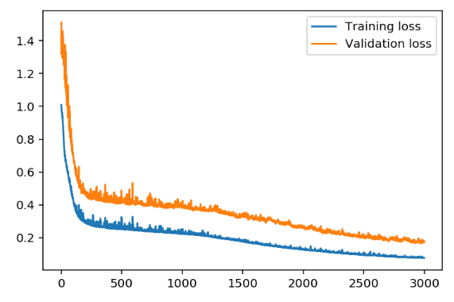

# Predicting Bike Sharing Patterns
This Repository stores my solution to the _"Predicting Bike Sharing Patterns"_ problem presented as the first project in the Deep Learning Nano Degree by Udacity.

### Overview
For this project I was given a dataset of bike sharing patterns, which can be found <a href="https://www.capitalbikeshare.com/system-data">here</a>. This data included the following attributes: 

* Duration – Duration of trip
* Start Date – Includes start date and time
* End Date – Includes end date and time
* Start Station – Includes starting station name and number
* End Station – Includes ending station name and number
* Bike Number – Includes ID number of bike used for the trip
* Member Type – Indicates whether user was a "registered" member or a "casual" rider


### Purpose
The goal of this project was to create a prediction model that took in the above attributes as inputs and predicted the number of bikes hired as an output.


### Methadology
1. First, I read the dataset into memory. Then I extract the relevent fields and scale the inputs against a mean and standard deviation found in the dataset. 

2. Next, I implement the solution for creating a Neural Network in python. All code for the implementation can be found <a href="https://github.com/MrDaubinet/Predicting-Bike-Sharing-Patterns/blob/master/my_answers.py">here</a>. 

3. Lastly, the Neural Network is initialized and trained. Its performance for training and validation loss can be seen in the image below. 



### Results
Finally, the Neural Network is run against unseen testing data with its accuracy shown in the image below.


### Conclusion
This project introduced me to the concepts of what a neural network is (all maths included) and what a neural network can do. It gave a practical real world example and a solution that utilizes deep learning. I thoroughly enjoyed it as my introduction into the deep learning nano degree.

# Get started
```
git clone https://github.com/MrDaubinet/
Predicting-Bike-Sharing-Patterns
cd Predicting-Bike-Sharing-Patterns
jupyter notebook
```
# Requirements
Jupyter notebook must be installed.
Python must be installed. The following python modules must be installed.
```
opencv-python
jupyter
matplotlib
pandas
numpy
pillow
scipy
tqdm
scikit-learn
scikit-image
seaborn
h5py
ipykernel
bokeh
pickleshare
```